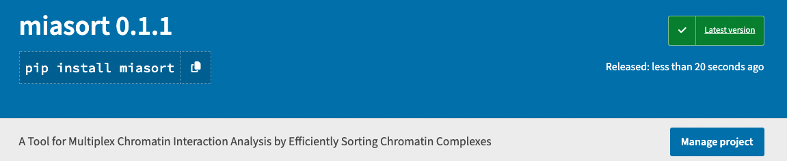
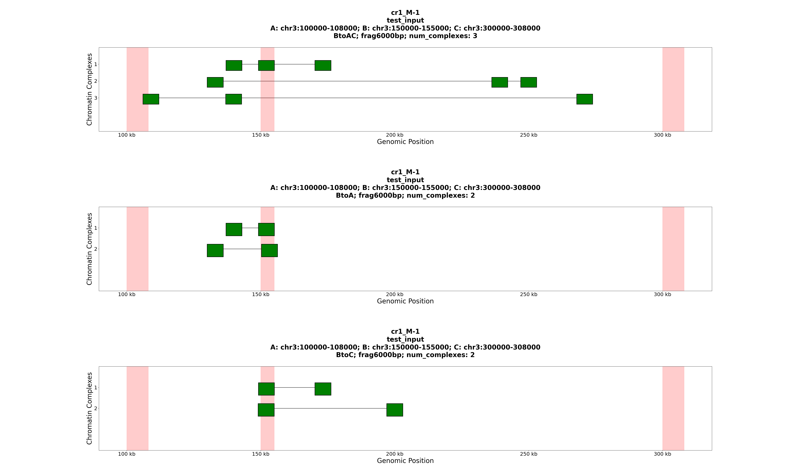
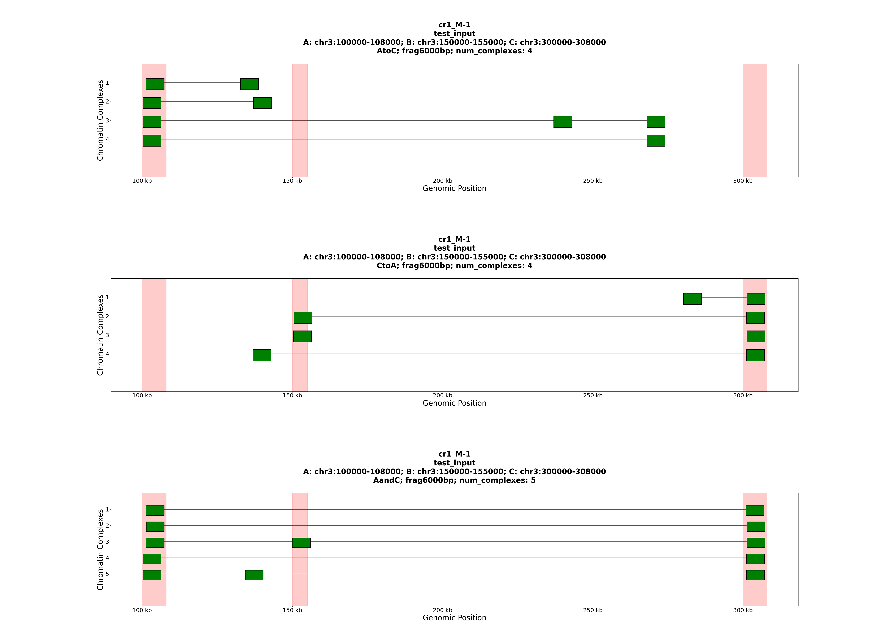
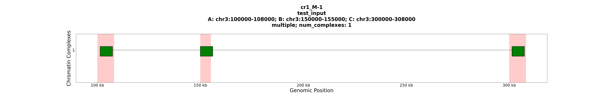
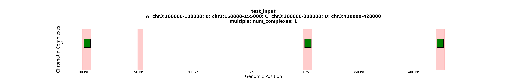

# MIA-Sort

**Authors**: *Zichen Zhang and Minji Kim*, University of Michigan

Code for the Paper "MIA-Sort: Multiplex Chromatin Interaction Analysis by Efficiently Sorting Chromatin Complexes"

## About

`miasort` is a Python Library for multiplex chromatin interaction analysis by efficiently sorting chromatin complexes.



To start using `miasort`, you need to install `bedtools`. To do so, follow instructions on https://bedtools.readthedocs.io/en/latest/content/installation.html#. One of the options is:

```Shell
$ mamba install -c conda-forge bedtools
```

After doing so, you can simply install our library:

```Shell
$ pip install miasort
```

## Documentation
### 1. `abc_sort()`

**Purpose**:
Sorts three regions and generates plots or histograms as needed.

**Parameters**:
- `path1` (str): Path to the first input file.
- `path2` (str): Path to the second input file.
- `graphs` (str): Graph configuration for sorting. There are in total 6 schemes: `AtoC`, `CtoA`, `AandC`, `Bcentered`, `BtoA` and `BtoC`. If you want all these 6 schemes, set this parameter as `AtoC;CtoA;AandC;Bcentered;BtoA;BtoC` (seperated by semicolons).
- `out_dir` (str, optional): Output directory for the results. Default is `'/'`.
- `plot` (bool, optional): Whether to generate plots. Default is `True`.
- `histogram` (bool, optional): Whether to generate histograms. Default is `False`.
- `anchor_option` (str, optional): Anchor options for sorting: `yes_complete` (drawing complex anchors), `yes_top` (drawing anchors on top of the plot), and `no` (do not draw anchors). Default is `'no'`.
- `colors` (str, optional): Colors for the anchors, fragments and lines on the plot respectively. Each item should be separated by a semicolon. Default is `'red;green;#525252'`.
- `num_frag_min` (int, optional): Minimum number of fragments required in one complex. Otherwise, we will not consider the complex. Default is `2`.
- `num_frag_max` (int, optional): Maximum number of fragments required in one complex. Otherwise, we will not consider the complex. Default is `1000`.
- `extension` (str, optional): Extension option for fragment drawing. It can be either `natural` (accurately represent each fragment's length) or an integer (each fragment's length will be set to this integer when the program outputs the plots). Default is `'6000'`.
- `frag_height` (float, optional): Fragment height for plots. Default is `0.6`.
- `line_width` (float, optional): Line width for plots. Default is `2.0`.
- `plot_width` (int, optional): Width of the plots. Default is `50`.
- `subplots_margins` (tuple of three elements, optional): Margins for subplots: `top`, `bottom` and `hspace` respectively. Learn more about these three metrics in [`matplotlib.pyplot.subplots_adjust`](https://matplotlib.org/stable/api/_as_gen/matplotlib.pyplot.subplots_adjust.html). Default is `(0.9, 0.05, 0.9)`.

**Usage**:
```Python
import miasort

miasort.abc_sort("./data/test_input.region",
                 "./data/test_input.domains",
                 "AtoC;CtoA;AandC;Bcentered;BtoA;BtoC",
                 out_dir="./test_folder_syn_6000",
                 anchor_option="yes_complete")
```

The same code is in `tests/test_abc_sort.py`. To run the code, you can use this commandxx`:

```Shell
$ ./tests/test_abc_sort.py
```

**Results**:
This code will produce two plots:

(1)

(2)


This code will also generate a CSV file:
```
Region ID,Site A,Site B,Site C,Region,Sort Scheme,num_complexes,num_1frag,num_2frag,num_3frag,num_4frag,num>=5frag
cr1_M-1,chr3:100000-108000,chr3:150000-155000,chr3:300000-308000,chr3:100000-308000,AtoC,4,0,3,1,0,0
cr1_M-1,chr3:100000-108000,chr3:150000-155000,chr3:300000-308000,chr3:100000-308000,CtoA,4,0,4,0,0,0
cr1_M-1,chr3:100000-108000,chr3:150000-155000,chr3:300000-308000,chr3:100000-308000,AandC,5,0,3,2,0,0
cr1_M-1,chr3:100000-108000,chr3:150000-155000,chr3:300000-308000,chr3:100000-308000,BtoAC,3,0,0,3,0,0
cr1_M-1,chr3:100000-108000,chr3:150000-155000,chr3:300000-308000,chr3:100000-308000,BtoA,2,0,2,0,0,0
cr1_M-1,chr3:100000-108000,chr3:150000-155000,chr3:300000-308000,chr3:100000-308000,BtoC,2,0,2,0,0,0
```

### 2. `multiple_sort()`

**Purpose**:
Sorts regions A, B, and C, generating plots or histograms as needed.

**Parameters**:
- `path1` (str): Path to the first input file.
- `path2` (str): Path to the second input file.
- `out_dir` (str, optional): Output directory for the results. Default is `'/'`.
- `plot` (bool, optional): Whether to generate plots. Default is `True`.
- `histogram` (bool, optional): Whether to generate histograms. Default is `False`.
- `anchor_option` (str, optional): Anchor options for sorting: `yes_complete` (drawing complex anchors), `yes_top` (drawing anchors on top of the plot), and `no` (do not draw anchors). Default is `'no'`.
- `colors` (str, optional): Colors for the anchors, fragments and lines on the plot respectively. Each item should be separated by a semicolon. Default is `'red;green;#525252'`.
- `num_frag_min` (int, optional): Minimum number of fragments required in one complex. Otherwise, we will not consider the complex. Default is `2`.
- `num_frag_max` (int, optional): Maximum number of fragments required in one complex. Otherwise, we will not consider the complex. Default is `1000`.
- `extension` (str, optional): Extension option for fragment drawing. It can be either `natural` (accurately represent each fragment's length) or an integer (each fragment's length will be set to this integer when the program outputs the plots). Default is `'6000'`.
- `frag_height` (float, optional): Fragment height for plots. Default is `0.6`.
- `line_width` (float, optional): Line width for plots. Default is `1.5`.
- `plot_width` (int, optional): Width of the plots. Default is `50`.
- `subplots_margins` (tuple of three elements, optional): Margins for subplots: `top`, `bottom` and `hspace` respectively. Learn more about these three metrics in [`matplotlib.pyplot.subplots_adjust`](https://matplotlib.org/stable/api/_as_gen/matplotlib.pyplot.subplots_adjust.html). Default is `(0.9, 0.05, 0.9)`.

**Usage**:
```Python
import miasort

miasort.multiple_sort("./data/test_input.region",
                      "./data/test_input_abc.domains",
                      out_dir="./test_folder_syn_AandBandC_6000",
                      anchor_option="yes_complete",
                      subplots_margins=(0.65, 0.15, 0.9))
```

The same code is in `tests/test_multiple_sort.py`. To run the code, you can use this command:

```Shell
$ ./tests/test_multiple_sort.py
```
**Results**:
This code will produce three plots. One of them is shown here:


This code will also generate a CSV file:
```
Region ID,Site A,Site B,Site C,Region,Sort Scheme,num_complexes,num_1frag,num_2frag,num_3frag,num_4frag,num>=5frag
cr1_M-1,chr3:100000-108000,chr3:150000-155000,chr3:300000-308000,chr3:100000-308000,AandBandC,1,0,0,1,0,0
cr1_M-2,chr3:100000-109800,chr3:150000-155000,chr3:300000-308000,chr3:100000-308000,AandBandC,1,0,0,1,0,0
cr1_M-3,chr3:100000-149000,chr3:150000-155000,chr3:300000-318000,chr3:100000-318000,AandBandC,1,0,0,1,0,0
```

### 3. `unlimited_multiple_sort()`

**Purpose**:
Allows for sorting an unlimited number of regions, generating plots or histograms as needed based on specified operations.

**Parameters**:
- `path1` (str): Path to the first input file.
- `regions` (str): A string of regions to be sorted, separated by semicolons. This should correspond to the `operations` parameter. In the case of the usage demo, we require every complex to have a fragment in anchors A, C and D, but *not* in anchor B.
- `operations` (str): Operations to be applied during sorting, separated by semicolons. This should correspond to the `regions` parameter.
- `out_dir` (str, optional): Output directory for the results. Default is `'/'`.
- `plot` (bool, optional): Whether to generate plots. Default is `True`.
- `histogram` (bool, optional): Whether to generate histograms. Default is `False`.
- `anchor_option` (str, optional): Anchor options for sorting: `yes_complete` (drawing complex anchors), `yes_top` (drawing anchors on top of the plot), and `no` (do not draw anchors). Default is `'no'`.
- `colors` (str, optional): Colors for the anchors, fragments and lines on the plot respectively. Each item should be separated by a semicolon. Default is `'red;green;#525252'`.
- `num_frag_min` (int, optional): Minimum number of fragments required in one complex. Otherwise, we will not consider the complex. Default is `2`.
- `num_frag_max` (int, optional): Maximum number of fragments required in one complex. Otherwise, we will not consider the complex. Default is `1000`.
- `extension` (str, optional): Extension option for fragment drawing. It can be either `natural` (accurately represent each fragment's length) or an integer (each fragment's length will be set to this integer when the program outputs the plots). Default is `'6000'`.
- `frag_height` (float, optional): Fragment height for plots. Default is `0.6`.
- `line_width` (float, optional): Line width for plots. Default is `1.5`.
- `plot_width` (int, optional): Width of the plots. Default is `50`.
- `subplots_margins` (tuple of three elements, optional): Margins for subplots: `top`, `bottom` and `hspace` respectively. Learn more about these three metrics in [`matplotlib.pyplot.subplots_adjust`](https://matplotlib.org/stable/api/_as_gen/matplotlib.pyplot.subplots_adjust.html). Default is `(0.9, 0.05, 0.9)`.

**Usage**:
```Python
import miasort

miasort.unlimited_multiple_sort("./data/test_input.region",
                                "chr3:100000-108000;chr3:150000-155000;chr3:300000-308000;chr3:420000-428000",
                                "yes;no;yes;yes",
                                out_dir="./test_folder_syn_multiple_6000",
                                anchor_option="yes_complete",
                                subplots_margins=(0.65, 0.15, 0.9))
```
The same code is in `tests/test_unlimited_multiple_sort.py`. To run the code, you can use this command:

```Shell
$ ./tests/test_unlimited_multiple_sort.py
```

**Results**:
This code will produce one plot:



## License
Shield: [![CC BY-NC-ND 4.0][cc-by-nc-nd-shield]][cc-by-nc-nd]

This work is licensed under a
[Creative Commons Attribution-NonCommercial-NoDerivs 4.0 International License][cc-by-nc-nd].

[![CC BY-NC-ND 4.0][cc-by-nc-nd-image]][cc-by-nc-nd]

[cc-by-nc-nd]: http://creativecommons.org/licenses/by-nc-nd/4.0/
[cc-by-nc-nd-image]: https://licensebuttons.net/l/by-nc-nd/4.0/88x31.png
[cc-by-nc-nd-shield]: https://img.shields.io/badge/License-CC%20BY--NC--ND%204.0-lightgrey.svg
